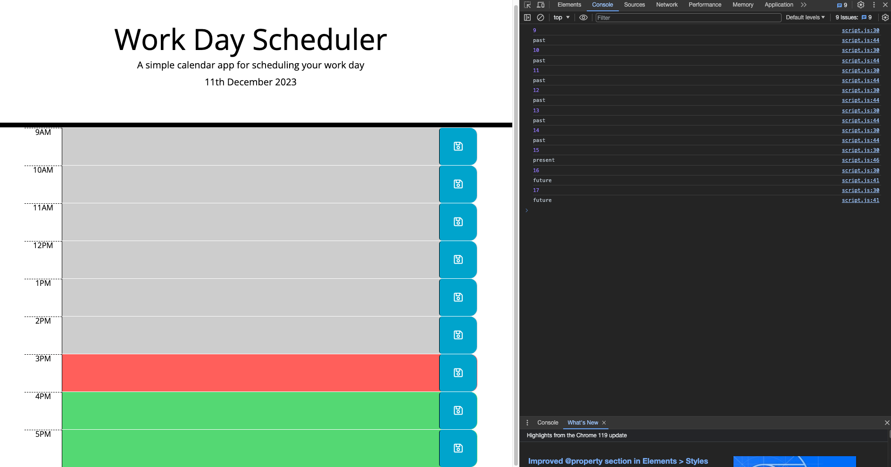
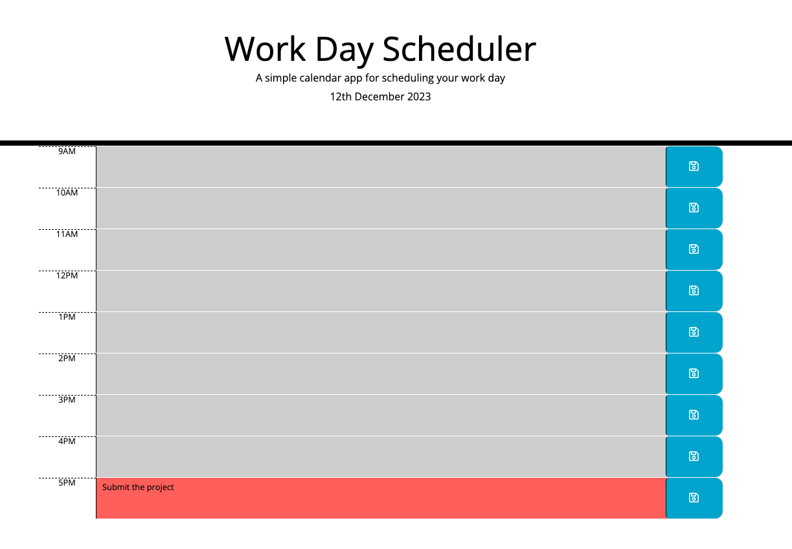

#  Work Day Scheduler

## Overview

A simple and efficient calendar application that empowers users to manage their daily schedule effectively. The app is built using HTML, CSS, and jQuery, with Day.js library integration for handling date and time.


## User Story

```md
AS AN employee with a busy schedule
I WANT to add important events to a daily planner
SO THAT I can manage my time effectively
```

## Instructions

The app should:

* Display the current day at the top of the calender when a user opens the planner.
 
* Present timeblocks for standard business hours when the user scrolls down.
 
* Color-code each timeblock based on past, present, and future when the timeblock is viewed.
 
* Allow a user to enter an event when they click a timeblock

* Save the event in local storage when the save button is clicked in that timeblock.

* Persist events between refreshes of a page

## Technologies Used

- HTML
- CSS
- JavaScript
- jQuery


##  Credits
Day.js: Day.js library for handling date and time.






<p>Link to  <a href="https://github.com/D-Tsonev/Work-Day-Scheduler">Repository</a><p>

<p>Link to  <a href="https://d-tsonev.github.io/Work-Day-Scheduler/">GitHub Page</a><p>